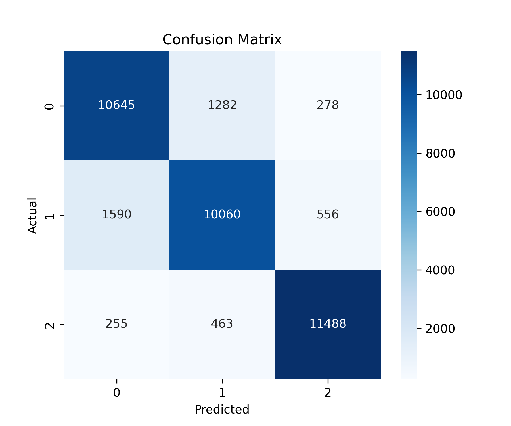
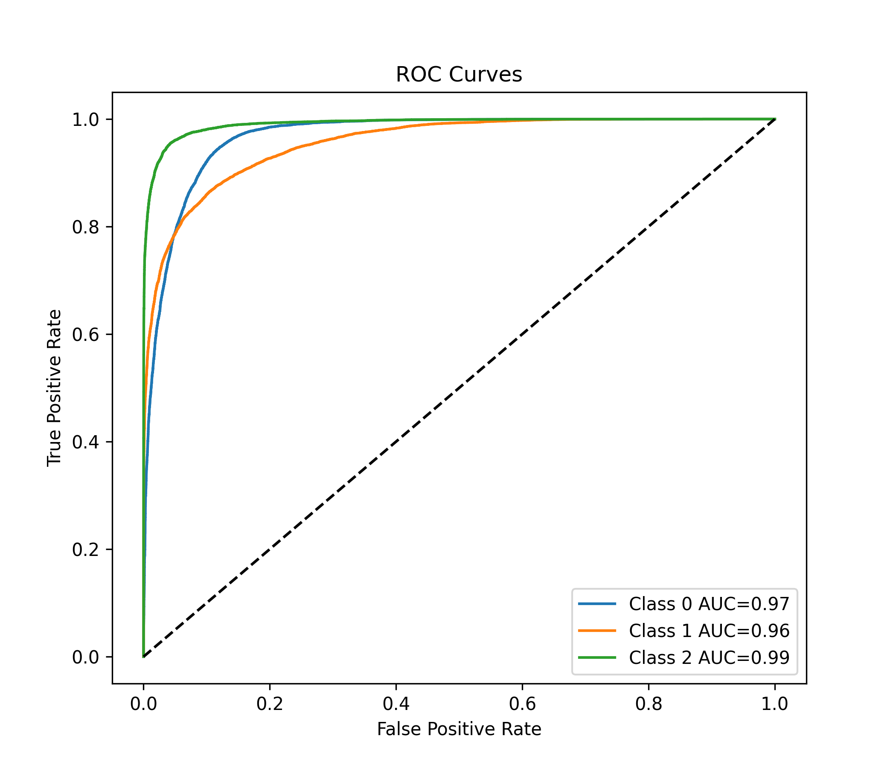
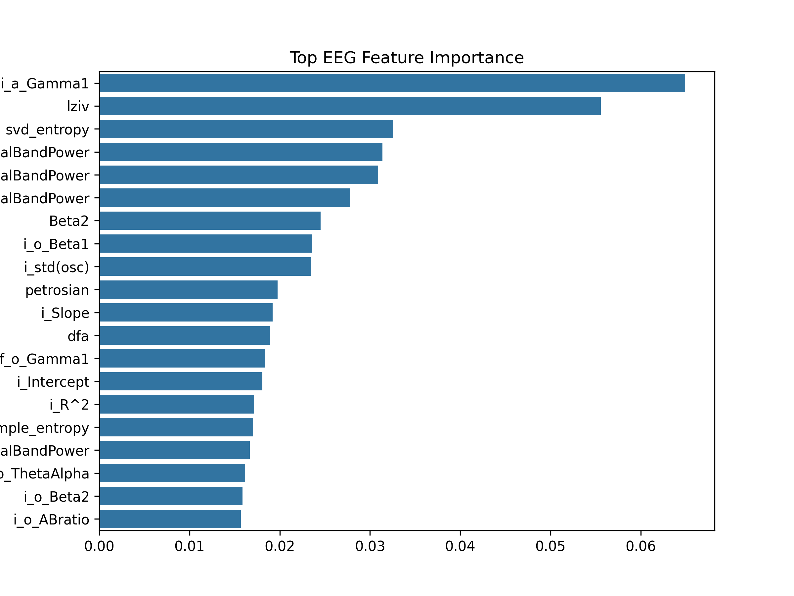
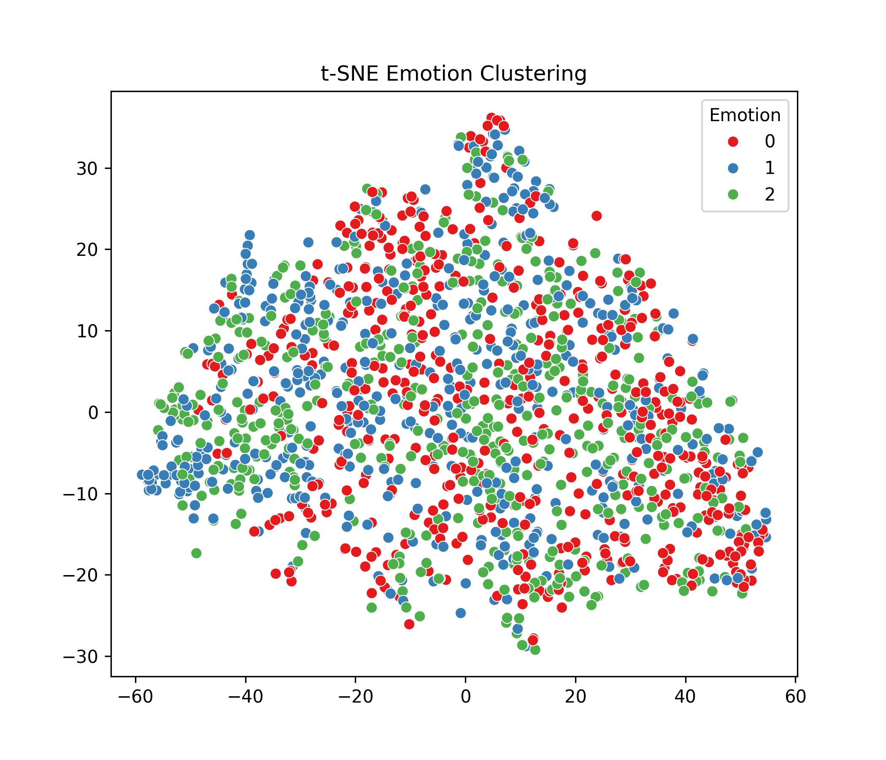

# EEG Emotion Prediction Module

## Overview
This module predicts emotional states from EEG features using an advanced XGBoost pipeline.

## Pipeline Steps
1. Data Loading
2. Preprocessing and Cleaning
3. Label Encoding
4. SMOTE Balancing
5. Feature Scaling
6. Feature Selection
7. Model Training (XGBoost)
8. Evaluation and Visualization

## Files

- preprocessing.py → Data cleaning + SMOTE
- train_model.py → Model training pipeline
- test_model.py → Model evaluation

## Outputs

<h3>Confusion Matrix</h3>

<h3>ROC Curves</h3>

<h3>Feature Importance</h3>

<h3>t-SNE Clustering</h3>

## Model Details
- Algorithm: XGBoost
- Multi-class classification
- Feature selection using importance ranking
- Class balancing using SMOTE

## Note
Raw EEG dataset is not included due to NIMHANS data restrictions.
