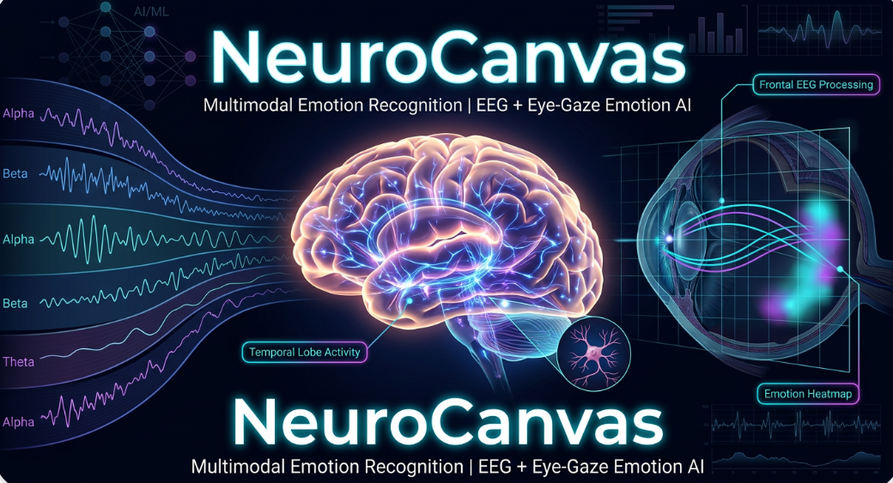

# 🧠👁️ NeuroCanvas  
### Multimodal Emotion Recognition using EEG & Eye-Gaze

  

---

## 🚀 Overview

**NeuroCanvas** is a multimodal emotion recognition framework that predicts human emotional states using:

- 🧠 **EEG Signals** (Neural Activity)
- 👁️ **Eye-Gaze Behavior** (Oculometric Features)

This project combines **deep neural insights** with **real-time behavioral signals** to build a robust and scalable emotion recognition system.

---

## 🎯 Key Highlights

- 📊 EEG-based emotion prediction using **XGBoost**
- 👁️ Eye-gaze emotion recognition using **4 ML models**
- 🧪 Achieved **97.62% accuracy** (MLP - Eye Gaze)
- 📈 EEG ROC-AUC up to **1.00**
- ⚡ Real-time system using **Tobii Eye Tracker**
- 🧩 Multimodal fusion using **synthetic integration**

---

## 🧠 EEG Module

- Dataset from **NIMHANS (Dream Analysis Study)**
- ~180,000 samples | ~70 features
- Labels generated using **VADER sentiment analysis**
- Techniques used:
  - SMOTE balancing
  - Feature selection
  - XGBoost classification

### 📊 Outputs

---

## 👁️ Eye-Gaze Module

- Data collected at **NIMHANS using Tobii Eye Tracker**
- Features:
  - avg_x, avg_y
  - std_x, std_y
  - avg_pupil
  - saccade_speed

### 🧠 Models Used

| Model          | Accuracy |
|---------------|---------|
| Random Forest | 90.00%  |
| CatBoost      | 94.92%  |
| XGBoost       | 95.00%  |
| MLP           | **97.62%** |

---

### 📊 Model Outputs

---

## ⚡ Real-Time System (OCULUS)

- 🎯 Live emotion prediction
- 📍 Gaze cursor tracking
- 🔥 Heatmap visualization
- 📊 Dashboard analytics
- 🎥 Stimulus-based evaluation (video + audio)

👉 Built using:
- Flask backend  
- OpenCV overlay  
- Tobii SDK  

---

## 🎥 Demo

[![Watch Real-Time Demo]](Eye_Gaze_Module/Demo/recording.mp4)

---

## 🧩 Multimodal Fusion

Due to restricted access to real-time EEG data, a **synthetic fusion approach** was implemented.

### 🔹 Fusion Strategy
- EEG predictions represented using **model probability outputs**
- Eye-gaze features combined with EEG outputs
- Late fusion using **weighted integration**

### 💡 Why Synthetic Fusion?

- EEG dataset cannot be publicly shared (NIMHANS restrictions)
- No simultaneous EEG + gaze dataset available
- Ensures **ethical data usage + reproducibility**

---

## 🛠️ Tech Stack

- Python  
- Scikit-learn  
- XGBoost, CatBoost  
- Flask  
- OpenCV  
- Tobii Eye Tracking SDK  
- Pandas, NumPy, Seaborn  

---

## 📂 Project Structure
NeuroCanvas/
├── EEG_Module/
├── Eye_Gaze_Module/
├── Fusion_Module/
├── Dashboard/
├── docs/

---

## 🔐 Dataset Note

- EEG dataset is sourced from **NIMHANS**
- Cannot be shared due to **data privacy policies**
- Full pipeline provided for reproducibility

---

## 👥 Contributors

- Sharon Zachariah  
- Harshitha PG 
- Shreya Paul  
- Vishaka Biju 

---

## 🚀 Future Scope

- Real-time EEG integration  
- Deep learning models (CNN, LSTM)  
- Multimodal deep fusion  
- Clinical mental health applications  

---

## ⭐ Final Insight

> Combining neural signals and behavioral patterns creates a more reliable and scalable emotion recognition system than traditional methods.

---
